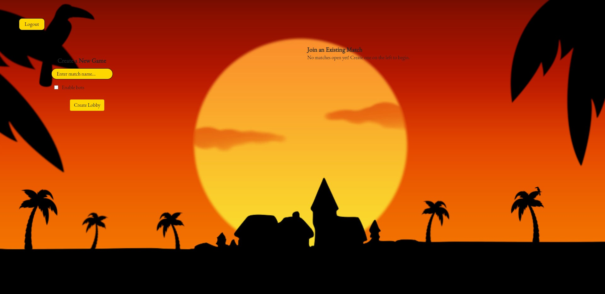
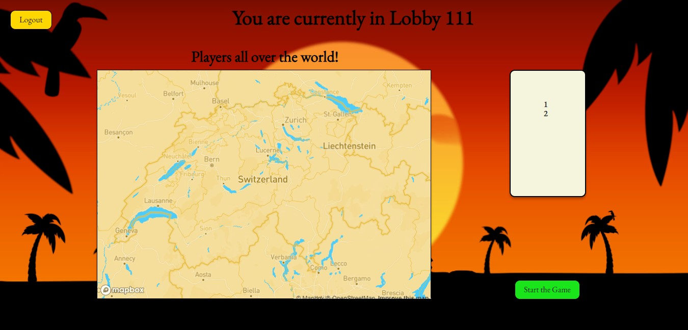
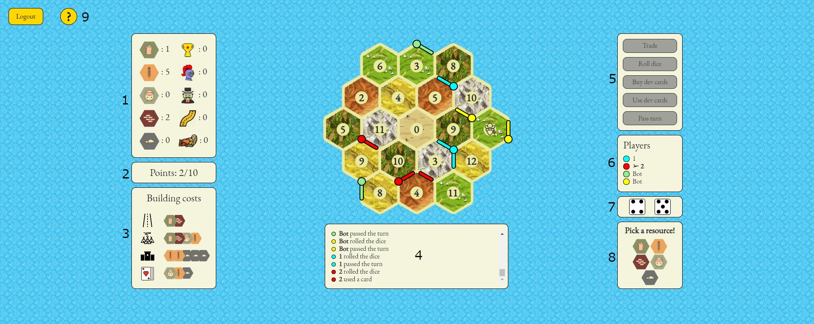
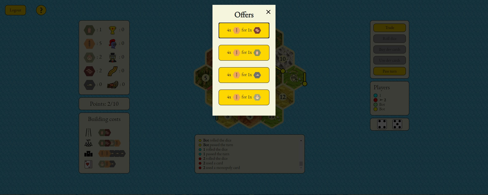

# The Settlers of Toucan

#### SoPra FS20 Group 16 - Frontend

## Introduction

Welcome! With "The Settlers of Toucan" we aim to create a fun strategy boardgame for everyone. This online
collaborative game allows you to play with friends, strangers and even bots. It is designed for up to four 
people in one game.

Collect resources and use them to build roads, settlements and cities. Expand your empire, use development 
cards and trading options in order to conquer the island of Toucan. Since every move affects every player, it will
 surely keep you on your toes. It gives you some time to establish your strategies - but watch out for the thief!

Based on simple concepts, this game does not fail to provide a diverting experience.

## Technolgies

The frontend was written with ReactJS version 16.12. The respective documentation can be found on the official website
[ReactJS Documentation](https://reactjs.org/docs/getting-started.html).
We also used various Javascript packages, which were handled by the Node Package Manager (npm). Again, how to use install
npm and how to use the various packages that are available, visit the [npm documentation](https://docs.npmjs.com/). 
We also used [Mapbox](https://docs.mapbox.com/help/tutorials/use-mapbox-gl-js-with-react/) as external API, to visualize 
the players' locations.

## High-level components

- [Dashboard](src/components/dashboard/Dashboard.js) This is where all the players meet and have the opportunity to create
a game lobby. The lobbies will be directly visible for all the other players that are hanging out on the dashboard and they
can join an existing game as long as there is a free spot in a lobby. Also, the players have the option to create a bot-enabled
lobby, with which they do not even have to wait for others and can directly start the fun.

- [Home](src/components/home/Home.js) This is the place where you can hang out with the other participants. What stands out
here is the interactive map provided by [Mapbox](https://www.mapbox.com/). On this map, every registered user is shown, as long
as he accepted the location-sharing option in the registration process. After deeply analysing the map, the lobby creator has
the option to actually start the game when she/he wants to.

- [Board](src/components/board) The heart of the frontend is the board. It is the key component, on which the players actually
play the game and make their turns on. It consists of 19 tiles in the shape of a hexagon. Also, the multiple tiles hold 
a number from 2-12 (except for 7) and also represent one of the resources that are necessary to progress in the game. The edges and vertices
are designed as building areas for the players. On the vertices the players can build settlements or cities and on the edges
the players can build roads.

- [Game](src/components/game) The game holds all the logic and actions for the players. The game component allows the players
to interact with the board and also to get the state of the game by visual means. It sends the turns of the players to the backend
and also shares the respective response to that turn on the board. The game component also includes necessary components such as the
action feed which provides information regarding the turns of players, the action box to choose the turns from and also a dice functionality
which is responsible for the distribution of resources.

## Launch & Deployment

To contribute to this project you can clone or fork this repository. If you want to add your changes or improvements
you can create a pull request. For more information visit the [Github Help Page](https://help.github.com/en/github).
If you choose to make a pull request, make sure the github actions task **Test Project** passes.

If your pull request is accepted, the project is automatically deployed to heroku. If you want to deploy your own
version check out this guide on 
[how to deploy spring boot applications to heroku](https://devcenter.heroku.com/articles/deploying-spring-boot-apps-to-heroku).

## Illustrations

The web application follows a classical structure. Beginning at the start page, the user has the option to login or register.
After registering or logging in, the users can take actions as desired.

### Startpage

On the start page, the user can decide if he wants to sign in or create a new account. Notable is, that the user has to decide
in the register page if he wants to share his location. When enabling this option, the user will be depicted on an interactive
map, where all the registered users, who shared their location, are also visible.

### Dashboard

Everythings start at the dashboard. The user can decide if he wants to join an active lobby or if he wants to create a new lobby.
When creating a new lobby, the user also has the option to enable or disable the participation of bots. The dashboard is designed as followed:

### Lobby

The lobby is the place where all the participants gather. The lobby creator is the host of this lobby, so he can decide when
the game should start. For the case that the lobby creator enabled bots, he can start the game when alone. When bots are disabled there have to be 
at least two players in the lobby to start the game. Another key feature in the lobby is the usage of the mentioned map by by [Mapbox](https://www.mapbox.com/). 
On this map the location of every registered user (online and offline) is shown, as long as the user chose to share the location on the register page.

### Game

The action takes place on the actual game screen. Here the players sees the board, his resources, his available turn and much more. 
The core of this screen is obviously the board itself, but there are many other important features and components surrounding the board.
On the graphic, elements 1-8 will be described in the legend below.

1: This container gives the player overview over the resources and development cards the player holds.

2: This element gives the player a sense of progression, it shows his/her points.

3: This container informs the player on how much roads, settlements, cities and development cards cost.

4: This is the feed. It shows what every player did in his/her respective turn.

5: This is the action box. Turns that are available for the player will be highlighted.

6: This container shows which player's turn it is at the moment. It also shows the player's color, which corresponds
to his roads and settlements which can be seen on the actual board.

7: Those are the dices. The dices will always show the last dice roll to all the players.

8: This is a pop-up window which is active, when a player decides to use a development card.

9: This is the help button for the players. If a player is unsure on certain game mechanics or has lost overview over the
resources, he can visit the help page to get his answers.

#### Usage of Modals
We have decided to use [Modals](https://www.w3schools.com/w3css/w3css_modal.asp) for a lot of the features, in order to keep the board itself as clean as possible. 
Features such as trading or using a certain development card use Modals. When taking such an action, the game board will be set to the background and the Modal will be
highlighted as followed:

### Ending a Game

When the game is over, a scoreboard will be shown to all the players and can return to the dashboard to play another fun
round of the Settlers of Toucan!

## Prerequisites and Installation

For your local development environment you'll need Node.js >= 8.10. You can download it [here](https://nodejs.org). All other dependencies including React get installed with:

### `npm install`

This has to be done before starting the application for the first time (only once).

### `npm run dev`

Runs the app in the development mode. 
Open [http://localhost:3000](http://localhost:3000) to view it in the browser.

The page will reload if you make edits. 
You will also see any lint errors in the console (use Google Chrome!).

### `npm run test`

Launches the test runner in the interactive watch mode. 
See the section about [running tests](https://facebook.github.io/create-react-app/docs/running-tests) for more information.

### `npm run build`

Builds the app for production to the `build` folder. 
It correctly bundles React in production mode and optimizes the build for the best performance.

The build is minified and the filenames include the hashes. 
Your app is ready to be deployed!

See the section about [deployment](https://facebook.github.io/create-react-app/docs/deployment) for more information.

## Roadmap

The game provides the opportunity for a wide range of possible features that could be added.
In the following we will explore a few by example, but those are only recommendations. If you have any addition
for the game that would improve the overall experience, do not hesitate!

### UI Adjustments

Such a game is almost never fully polished out. While the game already has a neat visual representation, there is always room
for improvement. For example the addition of a background theme song would be something which pushes the immersion for the player
further. Another interesting feature would be to change the theme of the board completely, so that the background would be frosty
mountains, and the resources the player could collect would be adjusted to that setting. There are almost no limitations for this one, 
let your creativity run free!
    
### Chat & Trade with players

As our Backend Team would love to see the addition of forming alliances within the game, we would also need the feature of a chat function.
But not only for possible alliances this would be cool, but also for trading not only with the bank, but also with other players. 
An expanding empire needs some exports and imports to grow fast. Also, if one player gets too dominant, a whisper function could
help out with flattening her/his growth curve by "accidentally" crossing his path with a road.
### Parametrize Game Variables

As of now, the game variables (such as required points to win, building costs etc.) are set as constants in the backend. But it would not be
a big deal to set those as parameters. For that case, a more fleshed out "creating lobby" window would be ideal. In this window
the player would have the option to change the required winning points, the occurrence of certain resources and many more variables which define
the way the game is being played.

## Authors and acknowledgement

We firstly want to thank our Teaching Assistant Moritz Eck for his continued and unwavering support for the duration
of this project.
For the SoPra FS20 we split the Group into a Frontend and Backend team. This required an early on specification of the
API endpoints. We thank everyone from the Backend team for their continued input in the API development process.

The SoPra FS20 Group 16 Frontend Team

## License

Distributed under the Apache 2.0 License. See LICENSE for more information.
